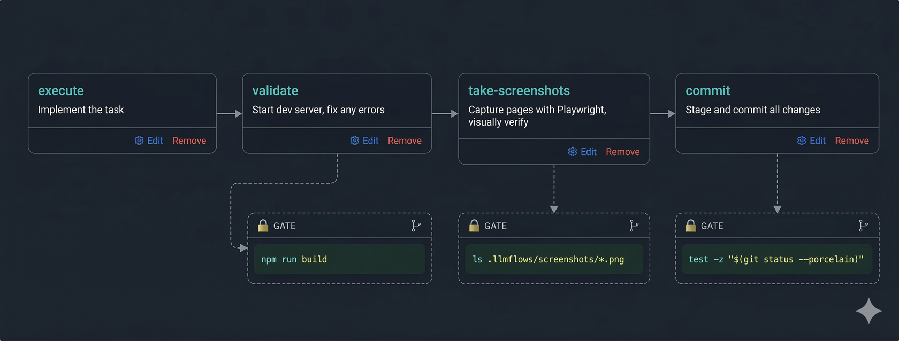

# llm-flows


**Structured workflows for AI coding agents** — multi-step flows with quality gates, wherever your agent runs.

> llm-flows doesn't replace your agent — it makes it more disciplined. Break complex tasks into ordered steps with enforced gates, and let the agent work through them autonomously. Install it on a personal VM, use it inside Cursor IDE, or add it to a cloud agent platform like Devin, Codex, or GitHub Copilot. Same protocol, same quality gates, everywhere.

---

## 🤔 Why llm-flows?

AI coding agents are powerful but undisciplined. Give one a prompt and it will rush through implementation, skip tests, ignore conventions, and produce a PR you spend more time reviewing than it saved you.

**The core problem:** agents work without structure.

- No enforced workflow — the agent decides what to do and in what order
- No quality checks — nothing stops it from advancing with broken tests
- No consistency — every run is a different approach to the same type of task
- No visibility — you don't know what the agent did until you review the diff

**llm-flows solves this** by giving agents a step-by-step protocol with enforced gates:

- 🔒 **Quality gates** — shell commands that must pass before the agent can advance (`npm run build`, `pytest`, linting)
- 📋 **Multi-step flows** — ordered sequences of steps, revealed one at a time
- 🔧 **Full customisation** — create your own flows, steps, and gates
- 📊 **Transparent execution** — every run is tracked with steps completed, summary, and outcome
- 🔌 **Agent-agnostic** — works with Cursor, Claude Code, Codex, or any agent that can run shell commands
- 🌐 **Runs anywhere** — personal VM, Cursor IDE, or cloud agent platforms

---

## 📦 Installation

```bash
curl -fsSL https://raw.githubusercontent.com/lpakula/llm-flows/main/scripts/install.sh | bash
```

Or install directly:

```bash
pipx install git+https://github.com/lpakula/llm-flows
```

### Upgrade

```bash
pipx upgrade llmflows
```

### Prerequisites

- Python 3.11+
- Git

---

## ⚙️ How it works

llm-flows is a CLI that agents interact with during execution:

```
📋 Create  →  🚀 Start  →  🔁 Step loop  →  ✅ Complete
```

**📋 Create** — a task with a title and description\
**🚀 Start** — bootstraps the run, outputs the protocol\
**🔁 Step loop** — agent calls `llmflows mode next` to get each step; gates are checked before advancing\
**✅ Complete** — agent summarizes the work with `llmflows run complete`

Gates are shell commands that must exit 0. If `npm run build` fails, the agent sees the error output and must fix the code. No skipping.

---

## 🧩 Example flow: `react-js`

A flow for React projects that enforces build checks and screenshot verification:



Each step is a markdown prompt with instructions and rules. Here's what a flow step looks like:

```json
{
  "name": "validate",
  "content": "# TEST\n\nStart the dev server and verify it compiles without errors...",
  "gates": [
    {
      "command": "npm run build",
      "message": "Build failed. Fix all compilation errors before advancing."
    }
  ]
}
```

When the agent runs `llmflows mode next` after the validate step, llm-flows executes `npm run build`. If it fails, the agent sees the error output and must fix the code before it can advance.

---

## 🚀 Use cases

### 🖥️ Personal VM — background daemon

Run a daemon that queues tasks, launches agents in isolated git worktrees, and monitors progress. Best for hands-off batch processing.

```bash
# One-time setup
llmflows daemon start
cd my-project && llmflows register

# Start the web UI
llmflows ui  # http://localhost:4200
```

Then manage everything from the **web UI**:

- 📝 **Create and manage tasks** — create tasks, start runs, pick flows
- 📡 **Live log streaming** — watch the agent work in real time
- 🔧 **Edit flows** — drag-and-drop step reordering, inline content editing, gate configuration
- 📦 **Import/export flows** — share flow definitions as JSON
- 📊 **View the queue** — see pending and executing runs across all projects

The daemon picks up pending tasks, creates a worktree branch, launches the agent, and monitors it. When done, you review the branch and merge.

Alternatively, everything can be done from the **CLI**:

```bash
llmflows task create -t "Add pagination" -d "Add cursor-based pagination to posts"
llmflows task start --id <task-id> --flow default
llmflows run logs <run-id> --follow
```

### ✏️ Cursor IDE — inline execution

Run a task directly from within an agent session. No daemon needed.

```bash
llmflows task create -t "Fix login bug" -d "Safari shows blank page on submit" --start
```

The `--start` flag bootstraps everything inline — registers the project if needed, creates the task and run, sets up a worktree, and outputs the protocol. The agent reads the instructions and starts working through the steps.

**Cursor command** — add `.cursor/commands/llmflows-start.md` to your project so you can trigger flows with `/llmflows-start`:

```markdown
---
description: Initialize llm-flows protocol
---

When starting a task, run:

llmflows task create -t "<title>" -d "<description>" --flow "<flow-name>" --start

If the user doesn't specify a flow name, use "default".

Then follow the protocol instructions in the output.
```

### ☁️ Cloud agent platforms — Devin, Codex, Cursor Automations, GitHub Copilot

Install llm-flows on the cloud VM and point the agent at it. Same structured workflows as your local setup.

**Init script** (runs when the VM starts):

```bash
pipx install git+https://github.com/lpakula/llm-flows
```

**Agent entrypoint** (AGENTS.md, .cursor/rules, or platform-specific config):

```
When starting a task, run:
llmflows task create -t "<title>" -d "<description>" --flow "<flow-name>" --start --no-worktree


Then follow the protocol instructions in the output.
```

The `--no-worktree` flag skips worktree creation since cloud VMs already provide an isolated checkout. The agent follows the same step-by-step protocol with enforced gates.

---

## 📚 Documentation

- **[CLI Reference](docs/cli.md)** — all commands
- **[Development](docs/development.md)** — contributing and local setup
